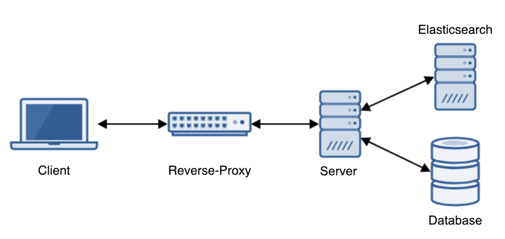

# Full-text Search in Django with Postgres and Elasticsearch

Course link in [Testdriven.io](https://testdriven.io/courses/django-full-text-search/)

## System Design

The system that's built over this course.

## Learnings

The course splits the system into of 4 parts.

1. Server (Django)
2. Full-text search in Database (Postgres)
3. Client (React)
4. Elasticsearch

The course explains one component at a time with increasing complexity. In the server side, it starts from (1) creating simple API then (2) connecting it to Postgres database then (3) using full-text search Postgres to generate relevant documents to user query.

The same for client side, it starts from (1) creating simple header then (2) adding `form` and `result list` then (3) adding word suggestion for query.

The most interesting part for me is the Elasticsearch. It offers faster way of searching compared to Postgres with much more functionality. Even though the course only introduce the `query`, `filter` and `suggest`, it gives me starting point to learn more about Elasticsearch.
